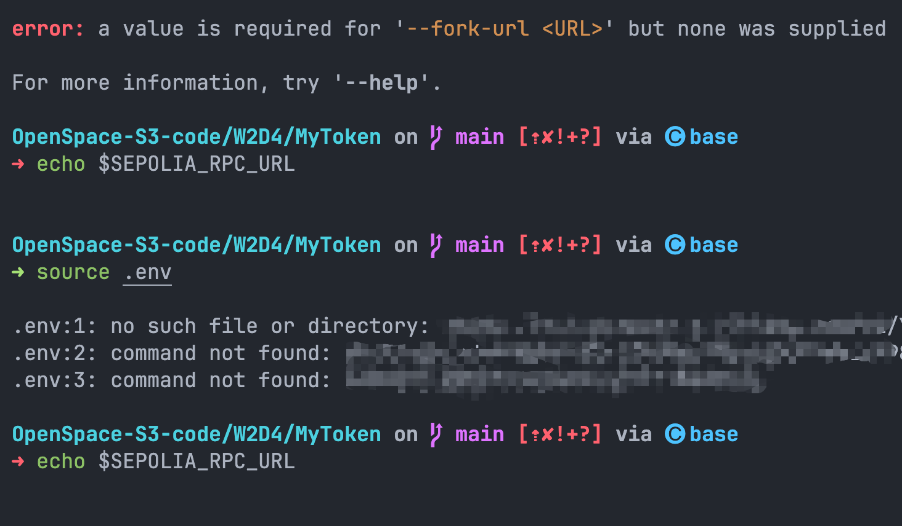
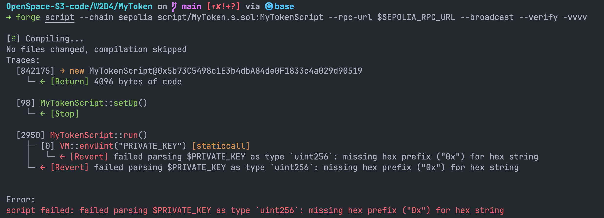

# 使用Foundry开发部署和开源ERC20合约

Foundry 是一个用于以太坊应用程序开发的快速、可移植和模块化的工具包，用Rust编写。

Foundry由以下部分组成：

- **Forge**：以太坊测试框架（类似于Truffle、Hardhat和DappTools）。
- **Cast**：与EVM智能合约、发送交易和获取链数据交互的瑞士军刀。
- **Anvil**：类似于Ganache、Hardhat Network的本地以太坊节点。
- **Chisel**：快速、实用且详细的solidity REPL。

## Foundry

**Foundry is a blazing fast, portable and modular toolkit for Ethereum application development written in Rust.**

Foundry consists of:

- **Forge**: Ethereum testing framework (like Truffle, Hardhat and DappTools).
- **Cast**: Swiss army knife for interacting with EVM smart contracts, sending transactions and getting chain data.
- **Anvil**: Local Ethereum node, akin to Ganache, Hardhat Network.
- **Chisel**: Fast, utilitarian, and verbose solidity REPL.

## Documentation

<https://book.getfoundry.sh/>

## Usage

### Build

```shell
forge build
```

### Test

```shell
forge test
```

### Format

```shell
forge fmt
```

### Gas Snapshots

```shell
forge snapshot
```

### Anvil

```shell
anvil
```

### Deploy

```shell
forge script script/Counter.s.sol:CounterScript --rpc-url <your_rpc_url> --private-key <your_private_key>
```

### Cast

```shell
cast <subcommand>
```

### Help

```shell
forge --help
anvil --help
cast --help
```

## 实操

### 安装Foundry

- <https://book.getfoundry.sh/getting-started/installation>

```shell
curl -L https://foundry.paradigm.xyz | bash

foundryup
```

### 创建项目

```shell
forge init MyToken
cd MyToken
```

### 编写合约

```solidity
// SPDX-License-Identifier: MIT
pragma solidity 0.8.20;

import "@openzeppelin/contracts/token/ERC20/ERC20.sol";

contract MyToken is ERC20 {
    constructor(
        string memory name_,
        string memory symbol_
    ) ERC20(name_, symbol_) {
        _mint(msg.sender, 1e10 * 1e18);
    }
}

```

### 安装依赖

```shell
forge install OpenZeppelin/openzeppelin-contracts
forge install OpenZeppelin/openzeppelin-contracts --no-commit
```

### 依赖映射

```shell
forge remappings > remappings.txt
```

### 编写测试脚本

```solidity
// SPDX-License-Identifier: UNLICENSED
pragma solidity ^0.8.13;

import {Test, console} from "forge-std/Test.sol";
import {MyToken} from "../src/MyToken.sol";

contract MyTokenTest is Test {
    MyToken public mytoken;

    address public owner = address(0x123);
    address public alice = address(0x456);
    uint256 public totalSupply = 1e10 * 1e18;

    function setUp() public {
        mytoken = new MyToken("MyToken", "MTK");
        console.log("Setup complete");
    }

    function testBalance() public view {
        assertEq(mytoken.balanceOf(owner), 0);
        assertEq(mytoken.balanceOf(alice), 0);
        assertEq(mytoken.balanceOf(address(this)), totalSupply);
    }

    function testTransfer() public {
        mytoken.transfer(alice, 100);
        assertEq(mytoken.balanceOf(owner), 0);
        assertEq(mytoken.balanceOf(alice), 100);
    }

    function testName() public view {
        assertEq(mytoken.name(), "MyToken");
    }
    function testSymbol() public view {
        assertEq(mytoken.symbol(), "MTK");
    }
    function testDecimals() public view {
        assertEq(mytoken.decimals(), 18);
    }
    function testTotalSupply() public view {
        assertEq(mytoken.totalSupply(), totalSupply);
    }
}

```

### 构建与测试

```shell
forge build
forge test -vvvv
```

### 编写部署脚本

```solidity
// SPDX-License-Identifier: UNLICENSED
pragma solidity ^0.8.13;

import {Script, console} from "forge-std/Script.sol";
import {MyToken} from "../src/MyToken.sol";

contract MyTokenScript is Script {
    MyToken public mytoken;

    function setUp() public {}

    function run() public {
        uint256 deployerPrivateKey = vm.envUint("PRIVATE_KEY");
        vm.startBroadcast(deployerPrivateKey);

        mytoken = new MyToken("MyToken", "MTK");

        console.log("MyToken deployed to:", address(mytoken));

        vm.stopBroadcast();
    }
}

```

### 部署合约

#### 1. 创建 .env 文件

```shell
touch .env
```

文件内容

```shell
SEPOLIA_RPC_URL=
PRIVATE_KEY=
ETHERSCAN_API_KEY=
```

#### 2. 修改 foundry.toml 文件，增加如下内容

```toml
solc = "0.8.20"
[rpc_endpoints]
sepolia = "${SEPOLIA_RPC_URL}"

[etherscan]
sepolia = { key = "${ETHERSCAN_API_KEY}" }
```

#### 3. 部署合约

```shell
source .env
forge script --chain sepolia script/MyToken.s.sol --rpc-url $SEPOLIA_RPC_URL --broadcast --verify -vvvv
```

#### 4. 报错解决

问题一：

##### 报错`error: a value is required for '--fork-url <URL>' but none was supplied` 原因：.env 文件中环境变量等号后有空格`SEPOLIA_RPC_URL= http...`



解决： 删除 .env 文件中环境变量等号后的空格
<https://github.com/Cyfrin/foundry-full-course-cu/discussions/216>

问题二：
报错：`script failed: failed parsing $PRIVATE_KEY as type`uint256`: missing hex prefix ("0x") for hex string`


解决：将 PRIVATE_KEY 值改为 0x 开头

#### 5. 成功部署

```shell
OpenSpace-S3-code/W2D4/MyToken on  main [⇡✘!+?] via 🅒 base took 8.6s 
➜ forge script --chain sepolia script/MyToken.s.sol:MyTokenScript --rpc-url $SEPOLIA_RPC_URL --broadcast --verify -vvvv  

[⠊] Compiling...
No files changed, compilation skipped
Traces:
  [502914] MyTokenScript::run()
    ├─ [0] VM::envUint("PRIVATE_KEY") [staticcall]
    │   └─ ← [Return] <env var value>
    ├─ [0] VM::startBroadcast(<pk>)
    │   └─ ← [Return] 
    ├─ [457806] → new MyToken@0xB8c3c8AE6cEb874C472e3aeb5CCBb15c82Aa5B20
    │   ├─ emit Transfer(from: 0x0000000000000000000000000000000000000000, to: 0x750Ea21c1e98CcED0d4557196B6f4a5974CCB6f5, value: 10000000000000000000000000000 [1e28])
    │   └─ ← [Return] 1824 bytes of code
    ├─ [0] console::log("MyToken deployed to:", MyToken: [0xB8c3c8AE6cEb874C472e3aeb5CCBb15c82Aa5B20]) [staticcall]
    │   └─ ← [Stop] 
    ├─ [0] VM::stopBroadcast()
    │   └─ ← [Return] 
    └─ ← [Stop] 


Script ran successfully.

== Logs ==
  MyToken deployed to: 0xB8c3c8AE6cEb874C472e3aeb5CCBb15c82Aa5B20

## Setting up 1 EVM.
==========================
Simulated On-chain Traces:

  [457806] → new MyToken@0xB8c3c8AE6cEb874C472e3aeb5CCBb15c82Aa5B20
    ├─ emit Transfer(from: 0x0000000000000000000000000000000000000000, to: 0x750Ea21c1e98CcED0d4557196B6f4a5974CCB6f5, value: 10000000000000000000000000000 [1e28])
    └─ ← [Return] 1824 bytes of code


==========================

Chain 11155111

Estimated gas price: 45.399486877 gwei

Estimated total gas used for script: 725574

Estimated amount required: 0.032940687291292398 ETH

==========================

##### sepolia
✅  [Success]Hash: 0xf1656b037f8c69b27bc6b991dac153957d46cbe7f5e046208ce01ec8bbfb0f6c
Contract Address: 0xB8c3c8AE6cEb874C472e3aeb5CCBb15c82Aa5B20
Block: 6283206
Paid: 0.012347370703835136 ETH (558336 gas * 22.114588176 gwei)

✅ Sequence #1 on sepolia | Total Paid: 0.012347370703835136 ETH (558336 gas * avg 22.114588176 gwei)
                                                                                                                                                                  

==========================

ONCHAIN EXECUTION COMPLETE & SUCCESSFUL.
##
Start verification for (1) contracts
Start verifying contract `0xB8c3c8AE6cEb874C472e3aeb5CCBb15c82Aa5B20` deployed on sepolia

Submitting verification for [src/MyToken.sol:MyToken] 0xB8c3c8AE6cEb874C472e3aeb5CCBb15c82Aa5B20.

Submitting verification for [src/MyToken.sol:MyToken] 0xB8c3c8AE6cEb874C472e3aeb5CCBb15c82Aa5B20.

Submitting verification for [src/MyToken.sol:MyToken] 0xB8c3c8AE6cEb874C472e3aeb5CCBb15c82Aa5B20.

Submitting verification for [src/MyToken.sol:MyToken] 0xB8c3c8AE6cEb874C472e3aeb5CCBb15c82Aa5B20.
Submitted contract for verification:
        Response: `OK`
        GUID: `jzrzcfi55na1d9vvqmik5khmhskqa2ekyyclzu43ryxudku2yk`
        URL: https://sepolia.etherscan.io/address/0xb8c3c8ae6ceb874c472e3aeb5ccbb15c82aa5b20
Contract verification status:
Response: `NOTOK`
Details: `Pending in queue`
Contract verification status:
Response: `OK`
Details: `Pass - Verified`
Contract successfully verified
All (1) contracts were verified!

Transactions saved to: /Users/qiaopengjun/Code/solidity-code/OpenSpace-S3-code/W2D4/MyToken/broadcast/MyToken.s.sol/11155111/run-latest.json

Sensitive values saved to: /Users/qiaopengjun/Code/solidity-code/OpenSpace-S3-code/W2D4/MyToken/cache/MyToken.s.sol/11155111/run-latest.json


OpenSpace-S3-code/W2D4/MyToken on  main [⇡✘!+?] via 🅒 base took 1m 0.9s 
➜ 
```

##### 部署后的合约链接地址

<https://sepolia.etherscan.io/address/0xb8c3c8ae6ceb874c472e3aeb5ccbb15c82aa5b20>


## 参考

- <https://book.getfoundry.sh/tutorials/solidity-scripting>
- <https://github.com/OpenZeppelin/openzeppelin-contracts/blob/master/contracts/token/ERC20/ERC20.sol>
- <https://github.com/Cyfrin/foundry-full-course-cu/discussions/216>
- <https://soliditylang.org/>
- <https://etherscan.io/>
- <https://dashboard.alchemy.com/>
- <https://eips.ethereum.org/EIPS/eip-20>
- <https://github.com/qiaopengjun5162/OpenSpace-S3-code/tree/main/W2D4/MyToken>
